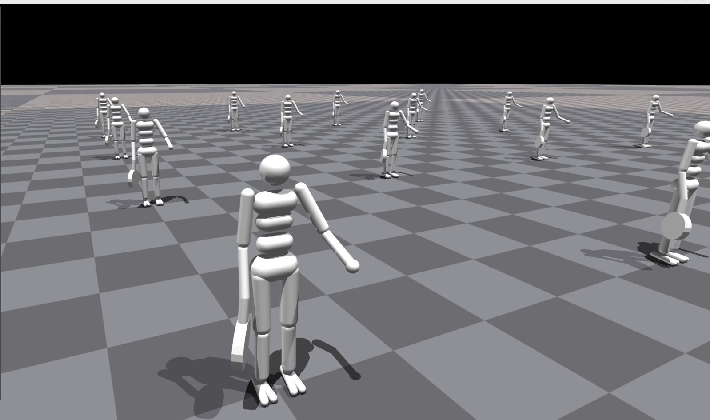
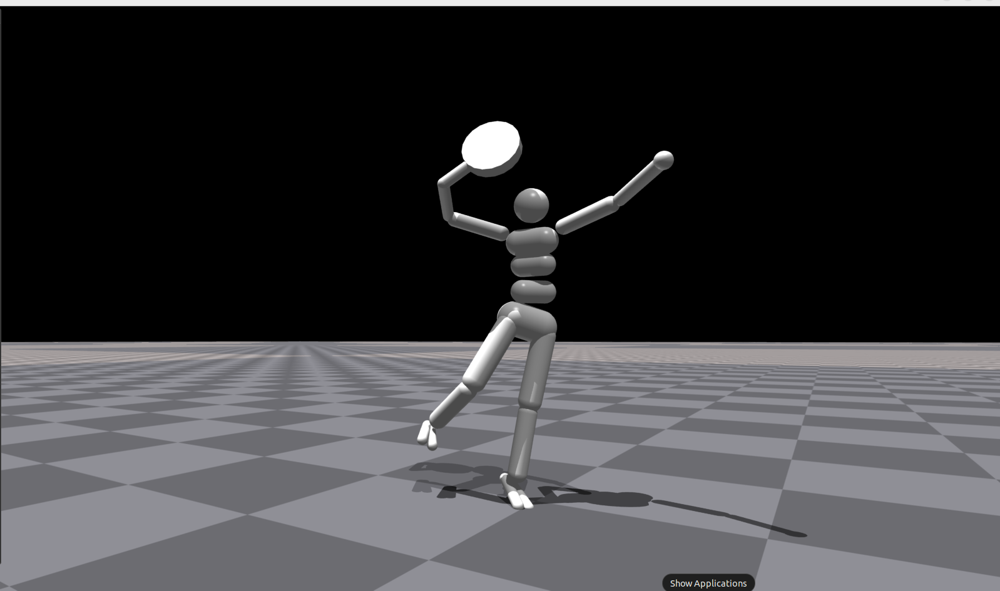

# Humanoid Tennis Serve Reinforcement Learning
Uses Reinforcement Learning to demonstrate the best tennis serve strategy


<table>
  <tr>
     <td align="center"><em>Before Training</em></td>
     <td align="center"><em>After Training</em></td>
  </tr>
  <tr>
    <td></td>
    <td></td>
  </tr>
</table>

## Description

Goals of the project: 
1. Create a tennis racket with appropiate joints in different degrees of freedom using MuJoCo physics engine.
2. Train the agent to perform a tennis serve using Reinforcement Learning algorithms. The main reward funciton is the speed of the "racket head".

Future improvements:
1. Perform Imitation Learning from expert demonstration using Adversarial Motion Priors(AMP) (https://github.com/NVIDIA-Omniverse/IsaacGymEnvs/blob/main/docs/rl_examples.md) 
2. Train the agent to perform a tennis serve with an added tennis ball in the environment using [Residual Reinforcement Learning](https://arxiv.org/abs/1812.03201) based on the policy learned from the AMP algorithm.
3. Train the agent to toss the ball with stability as the main reward funciton and height as the secondary reward.
4. Hit the ball at the desired height with the speed of the ball after the serve as the main reward function.
5. Create a virtual tennis court environment in MuJoCo physics engine, and train the Humanoid agent to perform a fast tennis serve while keeping the ball within the service area after perfoming a serve. 


## Getting Started

### Dependencies

* [IsaacGym](https://developer.nvidia.com/isaac-gym)
* Optional: [IsaacGymEnvs](https://github.com/NVIDIA-Omniverse/IsaacGymEnvs)
* Cuda >= 11.4
* PyTorch >= 1.12.0

### Installing

* See [IsaacGym](https://developer.nvidia.com/isaac-gym)

### Executing program

* How to run the program
* Step-by-step bullets
```
code blocks for commands
```

